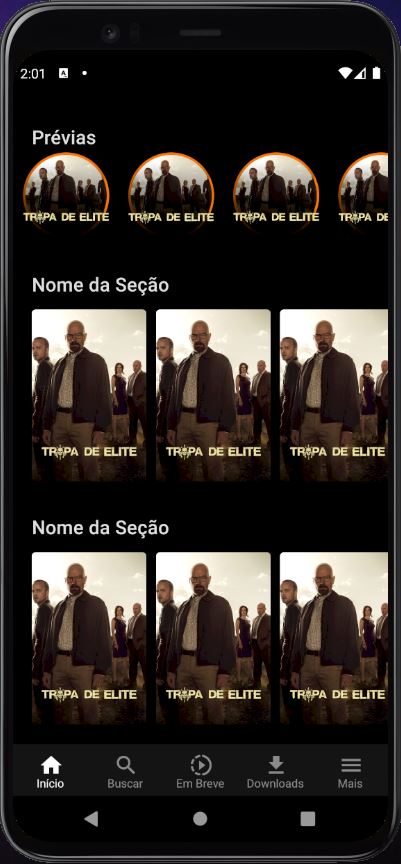

# Sabedoria Bíblica

Bem vindo ao um projeto criado em atender de forma mais robusta os ensinamentos bíblicos com provas arqueológicas. O desenvolvimento do projeto é constituído em quatro fases, são elas:

* Aplicativo (React - Native)
* Web (React Js)
* Servidor (Node Js)
* Hospedagem (AWS)

​	Até o momento foram criadas as primeiras linhas de código referente ao construção do App para Android, temos abaixo a primeira tela do projeto, divididas em duas partes.

<table border="1">
    <thead>
    	<tr>
        	<th>Tela de Início</th>
            <th>Previas e Seção</th>
        </tr>
    </thead>
    <tbody>
    	<tr>
        	<td align="center"></td>
            <td align="center"></td>
        </tr>
    </tbody>
</table>

​	 